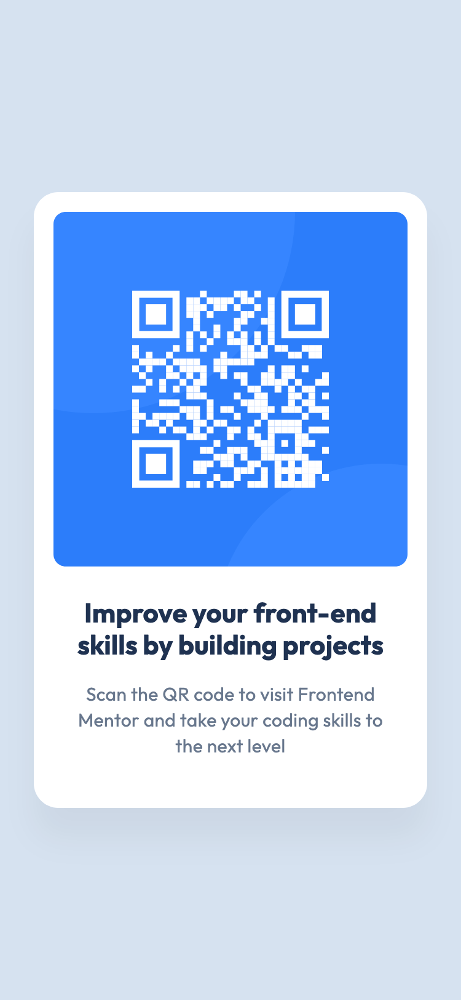
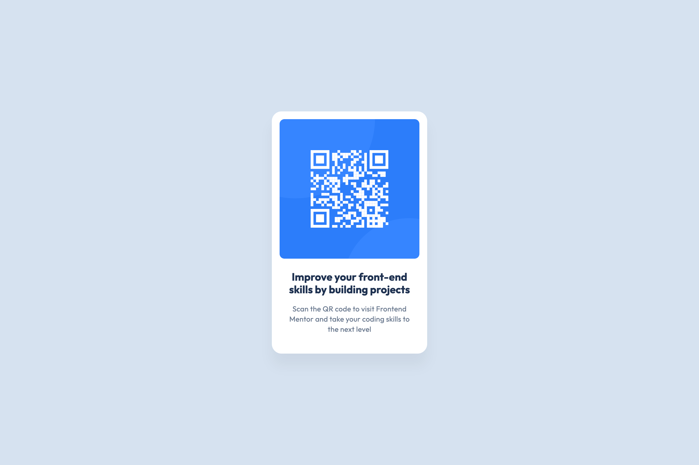

# Frontend Mentor - QR code component solution

This is my solution to the [QR code component challenge on Frontend Mentor](https://www.frontendmentor.io/challenges/qr-code-component-iux_sIO_H).

## Table of contents

- [Overview](#overview)
  - [Screenshots](#screenshots)
  - [Links](#links)
- [My process](#my-process)
  - [Built with](#built-with)
  - [What I learnt](#what-i-learnt)
  - [Useful resources](#useful-resources)

## Overview

### Screenshots

Mobile:



Desktop:


### Links

- [Solution URL](https://www.frontendmentor.io/solutions/qr-code-component-qNczXbCmzX)
- [Live site URL](https://qr-code-component-flame-two.vercel.app/)

## My process

### Built with

- Semantic HTML5 markup
- CSS custom properties
- Flexbox
- CSS Grid

### What I learnt

This is a great first project for getting the fundamentals right and learning about best practices.

It also gets you thinking in reusable components rather than full-page layouts, which will come in handy when it is time to learn React.

In the HTML, I focused on writing readable code that is properly structured and indented by using both a local Prettier installation and the Visual Studio Code extension.

I also made sure my code was semantic and accessible by using landmarks (such as `main`) as well as meaningful HTML elements that accurately describe the content and alt text that properly describes the image and its purpose.

In the CSS, I learnt how to self-host a variable font, convert it from a `.ttf` to a `.woff2` format for better optimisation and write a `@font-face` declaration:

```css
@font-face {
  font-family: "Outfit";
  src: url("/fonts/Outfit-VariableFont.woff2") format("woff2");
  font-weight: 100 900;
  font-display: swap;
}
```

I also avoided using a fixed width for the component and instead opted for a `max-width` in `rem`, so the component is responsive and scales with the user's text preferences. Similarly, I avoided fixed heights and only used a `min-height` on the `body` to center the component.

### Useful resources

- [Accessible Landmarks](https://www.scottohara.me/blog/2018/03/03/landmarks.html) - This blog post by Scott O'Hara explains landmarks and their roles in a very simple and easy-to-understand way. It also includes an example page at the end, which I used with a screen reader to better understand how landmarks are announced.
- [How to write good alt text for screen readers](https://www.craigabbott.co.uk/blog/how-to-write-good-alt-text-for-screen-readers/) - This article by Craig Abbott was shared in Frontend Mentor's Discord as a recommended resource for learning how to write effective alt text. It is easily the best resource I've found for explaining alt text in detail.
- [Using web fonts](https://fonts.google.com/knowledge/using_type/using_web_fonts) and [Loading variable fonts on the web](https://fonts.google.com/knowledge/using_type/loading_variable_fonts_on_the_web) - These two guides by Google Fonts helped me self-host the variable font and set it up correctly in the project.
