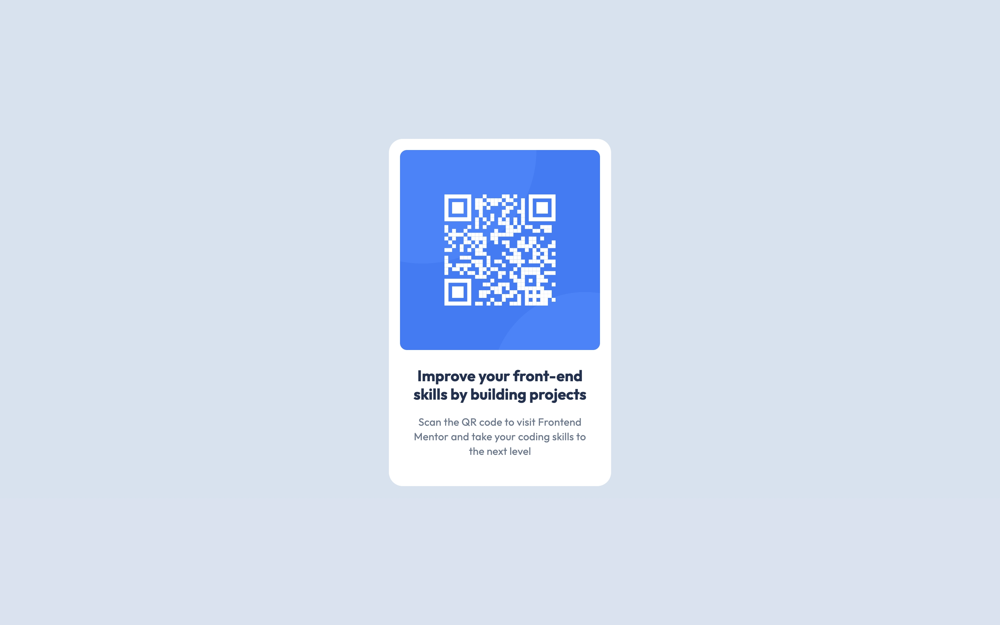

# QR Code Component

A QR code component card built with semantic HTML and CSS.

## 🔗 Links

Live site: [View live](https://qr-code-component-dionysialemonaki.vercel.app/)

## 📸 Screenshots

Mobile:


Desktop:



## 🏗️ Built With

- Semantic HTML
- CSS custom properties
- Flexbox

## 🎨 What I focused on

### Semantic Structure

All content is enclosed in a `<main>` landmark, which denotes the primary content of the page.

```html
<main>
  <div class="card">
    
    <div class="card-content">
      <h1 class="card-title">...</h1>
      <p class="card-description">...</p>
    </div>
  </div>
</main>
```

### Sizing the Image Correctly and Providing Accessible Alt Text

The `` element has accessible alternative text which accurately conveys the meaning and purpose of the image to screen readers.

It also has explicit `width` and `height` attributes which instruct the browser to reserve the correct amount of space while the image is loading, which in turn prevents layout shift and improves performance and user experience. In CSS, `max-width: 100%; height: auto` then let it scale down responsively.

```css
img {
  display: block;
  max-width: 100%;
  height: auto;
}
```

### Font Loading

The variable font is loaded with a single `@font-face` declaration. `font-display: swap` avoids a blank text flash while it loads.

```css
@font-face {
  font-family: "Outfit";
  font-style: normal;
  font-weight: 100 900;
  font-display: swap;
  src: url("./assets/fonts/Outfit-VariableFont.woff2") format("woff2");
}
```

### Design Tokens as Custom Properties

Colors and type scale are named in `:root` rather than repeated as raw values, so the palette and scale are declared once and referenced everywhere they're used.

```css
:root {
  --color-slate-900: hsl(218 44% 22%);
  --color-slate-500: hsl(216 15% 48%);
  --color-slate-300: hsl(212 45% 89%);
  --color-white: hsl(0 0% 100%);

  --font-outfit: "Outfit", sans-serif;
  --text-large: 1.375rem;
  --text-base: 0.9375rem;
}
```

### A Global Reset

Margin, padding, and font are reset on every element, but box-sizing is applied separately to `*::before` and `*::after` as well.

```css
*,
*::before,
*::after {
  box-sizing: border-box;
}

* {
  margin: 0;
  padding: 0;
  font: inherit;
}
```

## Credits

Design from [Frontend Mentor](https://www.frontendmentor.io/challenges/qr-code-component-iux_sIO_H)
